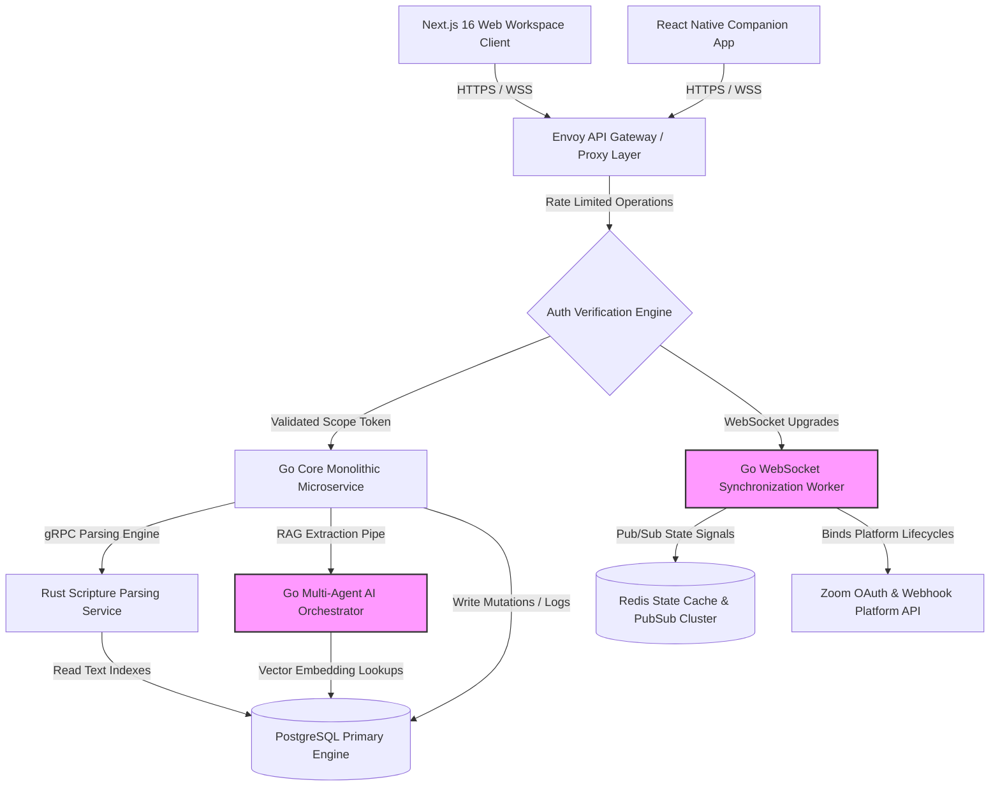

# ARCHITECTURE.md

> Implementation note, 2026-06-26: remediation is targeting the repo-current stack (`go.mod` toolchain Go 1.24.3, `web/package.json` Next.js 16.2.9, React 19.2.3) while preserving the architecture's `/api/v1/*` public route direction. Older version targets in this document remain aspirational until a dedicated upgrade PR changes the manifests.

## 1. Product Summary
ScriptureForge AI (alternatively known as BibleStudyOS or ScriptureFlow) is a production-grade, multi-tenant, cloud-native Bible Study Operating System and Mobile Ecosystem. It resolves the core market gap between complex, academic desktop applications (e.g., Logos, Accordance) and overly simplistic consumer reading apps (e.g., YouVersion). 

The platform provides a unified ecosystem delivering:
*   **Trustworthy, Citation-First AI Insights:** AI generation that strictly references primary theological data sources, commentaries, lexicons, and Scripture coordinates with transparent denominational/doctrinal guardrails.
*   **Synchronized Live Bible Study Rooms:** A real-time, collaborative hybrid study canvas featuring native deep integrations with video conferencing platforms (primarily Zoom) to unify text analysis, group interaction, attendance tracking, and prayer management on a single interface.
*   **Sermon-to-Discipleship Content Pipelines:** Automated asynchronous workflows translating primary teaching outlines/transcripts into multi-channel micro-devotionals, youth lessons, and participant discussion guides.

---

## 2. Core Product Vision
The long-term vision of ScriptureForge AI is to serve as the definitive decentralized software layer for biblical education, collaborative study, and organizational workflow automation in church networks and academic institutions. 

To achieve this, the architecture implements a decoupled, highly concurrent engine capable of handling high transactions-per-second (TPS)—particularly around real-time synchronization during active study windows—while enforcing immutable audit logs for AI-generated outputs. The technical layout directly guarantees that scaling to millions of concurrent requests will not compromise isolation boundaries, user data privacy, or data integrity.

---

## 3. Target Users

```
+---------------------------------------------------------------------------------+
|                               PERMISSION MATRIX                                 |
+----------------------+--------------------+-------------------------------------+
| Role                 | Privilege Level    | System Boundary Scope               |
+----------------------+--------------------+-------------------------------------+
| Everyday Believer    | `User`             | Read-only global library, read/write|
|                      |                    | personal journals, read/write personal|
|                      |                    | prayer requests. Participant room   |
|                      |                    | access features.                    |
+----------------------+--------------------+-------------------------------------+
| Small Group Leader   | `Moderator`        | Create/manage group workspaces,     |
|                      |                    | generate group guides, launch       |
|                      |                    | Live Rooms, view aggregated group   |
|                      |                    | attendance and shared prayer logs.  |
+----------------------+--------------------+-------------------------------------+
| Pastor / Teacher     | `Author`           | Full sermon workspace privileges,   |
|                      |                    | advanced lexicon tools, structural  |
|                      |                    | content repurposing, curriculum     |
|                      |                    | creation systems.                   |
+----------------------+--------------------+-------------------------------------+
| Church Administrator | `Tenant_Admin`     | Organization-wide configuration,    |
|                      |                    | doctrinal profile lockouts, billing,|
|                      |                    | bulk member provisioning, custom    |
|                      |                    | resource shelf whitelist settings.  |
+----------------------+--------------------+-------------------------------------+
| System Administrator | `Super_Admin`      | Global platform diagnostics, infrastructure|
|                      |                    | telemetry, global tenant routing,    |
|                      |                    | security audit enforcement.        |
+----------------------+--------------------+-------------------------------------+
```

---

## 4. Key Use Cases & Workflows

### 4.1 AI-Driven Multi-Tier Study Generation
*   **Actor:** Small Group Leader (`Moderator`).
*   **Flow:** The user selects a text segment (e.g., *James 1:2–8*), identifies the audience target (*Youth*), specifies a runtime constraint (*45 minutes*), and sets the theological filter (*Evangelical*). 
*   **Execution:** The backend RAG pipeline queries the semantic database vector space, builds an isolated structural context package, feeds it to the LLM orchestrator alongside absolute system guardrails, and outputs matching synchronized structures: opening prayers, participant handouts, private leader notes, contextual breakdowns, and localized discussion questions.

### 4.2 Synchronized Live Study Room Execution with Third-Party Video
*   **Actor:** Small Group Leader (`Host`), Multiple Believers (`Participants`).
*   **Flow:** Host triggers a scheduled "Live Room" session. 
*   **Execution:** The system connects via secure WebSockets to a dedicated state coordinator while firing API webhooks to spin up/bind an active Zoom conference. The participant screen realigns dynamically: text changes, focus highlights, and revealed discussion items push out via real-time payloads. At the conclusion of the session, participant presence counters write directly to an immutable ledger, and user prayer boards freeze and archive.

### 4.3 Automated Sermon Discipleship Repurposing
*   **Actor:** Pastor (`Author`).
*   **Flow:** Pastor drops a text transcript or raw markdown sermon layout into the Sermon Workspace.
*   **Execution:** An asynchronous processing worker chunks the content, validates the textual integrity against canonical scripture blocks, and pipes queries through specialized multi-agent subroutines to extract core arguments. The system saves 5 discrete daily devotionals, a parent-child discussion template, a matching small group question pack, and a semantic tag map directly into the tenant's global asset distribution library.

---

## 5. Feature Architecture

### 5.1 Authentication, Account & Workspace Management
*   **Purpose:** Multi-tenant credential tracking, organization boundaries, and session token provisioning.
*   **Core Responsibilities:** Processing security tokens, validating JWT signatures with short lifespans (15 minutes) coupled with database-backed opaque refresh tokens, and enforcing logical isolation using strict Postgres row-level security (RLS).
*   **Main API Routes:**
    *   `POST /api/v1/auth/register`
    *   `POST /api/v1/auth/login`
    *   `POST /api/v1/auth/refresh`
    *   `POST /api/v1/auth/logout`
    *   `POST /api/v1/auth/mfa/verify`
    *   `POST /api/v1/auth/mfa/enroll`
    *   `POST /api/v1/workspaces/switch`
    *   `POST /api/auth/register` (compatibility alias)
    *   `POST /api/auth/login` (compatibility alias)
*   **Data Entities:** `User`, `Organization`, `Workspace`, `Session`, `RefreshToken`.
*   **Security Considerations:** Cryptographic salt hashing via Argon2id. Multi-factor authentication (MFA) via TOTP protocols is structurally mandatory for `Tenant_Admin` and `Super_Admin` actors.
*   **Failure Modes & Logic Risks:** Tenant bleeding (cross-tenant visibility via corrupted workspace session swapping). Mitigation involves appending `organization_id` implicitly to all database queries via an authenticated context wrapper, completely isolating it from direct client parameters.

### 5.2 Role-Based Access Control (RBAC) & Permissions
*   **Purpose:** Granular data verification engine ensuring exact feature execution based on user clearance levels.
*   **Core Responsibilities:** Evaluate runtime access requests against explicit resource scopes (e.g., `workspace:guides:write`).
*   **Main API Routes:** Internal middleware assertion engine.
*   **Data Entities:** `Role`, `Permission`, `UserRoleAssignment`.
*   **Security Considerations:** Deny-by-default logic architecture. Every database read, mutation, or socket channel subscription intercepts a bitmask comparison check.
*   **Failure Modes & Logic Risks:** Privilege escalation via parameter manipulation. This is countered by relying exclusively on cryptographically signed, immutable server-side JWT claims containing the primary account permissions.

### 5.3 ScriptureForge AI Core (Orchestration Engine)
*   **Purpose:** Secure, deterministic retrieval-augmented generation engine producing zero-hallucination studies and content assets.
*   **Core Responsibilities:** Pre-processing user prompts, building structural vector index vectors via embedding pipelines, compiling source citation pathways, and verifying downstream data profiles before execution.
*   **Main API Routes:**
    *   `POST /api/v1/ai/generate/study`
    *   (Planned) `POST /api/v1/ai/generate/devotional`
    *   (Planned) `POST /api/v1/ai/ask`
*   **Data Entities:** `AIRequestLog`, `TheologicalProfile`, `CitationTrail`, `GeneratedAsset`.
*   **Security Considerations:** Malicious prompt injection filtering, strict egress scanning to prevent generation of unauthorized content profiles, and semantic tracing vectors.
*   **Failure Modes & Logic Risks:** Hallucinated data parameters masking as factual biblical source references. Countermeasures involve enforcing an isolated matching system that maps LLM outputs against a fixed SQL database index of standard biblical metadata (lexicons, verses) via standard regex/deterministic matches. Any citation failing the verification step drops the output confidence level instantly to zero and triggers a system fault block.

### 5.4 Live Bible Study Rooms (Real-time Sync & Integration)
*   **Purpose:** Coordinate high-frequency real-time event distribution and application state tracking for synchronous studies.
*   **Core Responsibilities:** Manage active state objects for all live instances, process client socket pipelines, interface with meeting APIs, and distribute dynamic structural changes across clients.
*   **Main API Routes & Endpoints:**
    *   `GET /api/v1/rooms/active`
    *   `POST /api/v1/rooms/create`
    *   `WSS /api/v1/rooms/stream/{room_id}`
    *   `GET /api/v1/rooms/state/{room_id}`
    *   `POST /api/webhooks/zoom`
*   **Data Entities:** `LiveRoom`, `RoomParticipant`, `RealtimeStateEvent`, `AttendanceLog`.
*   **Security Considerations:** Token authorization inside the initial WebSocket upgrade handshake. Socket identifiers must match active database user accounts.
*   **Failure Modes & Logic Risks:** State race conditions (multiple users updating fields or chat states concurrently). Mitigation relies on processing mutations through single-threaded Redis Lua scripts, achieving lockstep linear event tracking.

---

## 6. Recommended Tech Stack

### 6.1 Backend API Layer & Core Business Services
*   **Technology:** **Go (Golang 1.24.3 target)**
*   **Justification:** Go establishes memory-safe data allocation models, guarantees stellar multi-threaded concurrent performance through native lightweight green threads (goroutines), and provides low baseline latency numbers without complex runtime overhead. It ensures predictable performance profile under heavy WebSocket communication flows.

### 6.2 Scripture Engine & Morphological Processor
*   **Technology:** **Rust (Stable 2026)**
*   **Justification:** Complex lexical calculations, original language morphology mapping, lemma tracking, and text parsing require direct CPU micro-optimization and compile-time memory safety bounds. Rust modules communicate natively with Go business layers over highly optimized gRPC channels using Protocol Buffers.

### 6.3 Front-End Web Application (Workspace Center)
*   **Technology:** **Next.js 16 (App Router with TypeScript)**
*   **Justification:** Next.js establishes flawless Server-Side Rendering (SSR) engines optimizing initial load pipelines for complex biblical textual frameworks. TypeScript prevents typing corruption within large application state boundaries.

### 6.4 Mobile Client Companion
*   **Technology:** **React Native via Expo Architecture**
*   **Justification:** Enables code-reuse patterns across the web and mobile layers for cross-platform components (e.g., Live Room views, state pipes) while maintaining fluid interaction speeds over native UI layouts.

### 6.5 Persistence & Data Layout Layer
*   **Database:** **PostgreSQL 17+** with the **pgvector** module extension activated.
*   **Caching & State Cache Engine:** **Redis 7.4+**
*   **Justification:** PostgreSQL manages core entity mappings with rigorous transactional safety rules (ACID compliance) and row-level protection filters. `pgvector` drives our internal multi-dimensional semantic search and theological data tracking indexes. Redis stores ephemeral state models for active Live Rooms, orchestrates the pub/sub event distribution lines, and controls global API rate-limiting blocks.

---

## 7. System Architecture Overview



---

## 8. External Integrations & API Adapters

The system isolates third-party entities behind tightly declared, strongly-typed domain interfaces. Concrete instances handle transport layouts, data transformations, and payload abstractions.

```go
package adapters

import (
	"context"
	"time"
)

type MeetingMetadata struct {
	MeetingID   string    `json:"meeting_id"`
	JoinURL     string    `json:"join_url"`
	StartToken  string    `json:"start_token,omitempty"`
	Passcode    string    `json:"passcode"`
	ScheduledAt time.Time `json:"scheduled_at"`
}

type AttendanceRecord struct {
	UserID    string        `json:"user_id"`
	Duration  time.Duration `json:"duration"`
	JoinedAt  time.Time     `json:"joined_at"`
	LeftAt    time.Time     `json:"left_at"`
}

// MeetingAdapter dictates full system compliance for integrated conference runtimes
type MeetingAdapter interface {
	CreateMeeting(ctx context.Context, title string, startTime time.Time, duration int) (*MeetingMetadata, error)
	FetchAttendance(ctx context.Context, meetingID string) ([]AttendanceRecord, error)
	TerminateMeeting(ctx context.Context, meetingID string) error
}
```

### Error Normalization and Fail-Safe Rules
1.  **Circuit Breaking:** All integrations use an internal circuit breaker framework. If calls to Zoom drop below a 90% success rate within a sliding window of 60 seconds, the engine trips the breaker.
2.  **Graceful Degradation:** When the circuit breaker trips, the system gracefully degrades. Instead of blocking operations, it pivots to an "Offline/In-Person" configuration mode, generating structured fallback links that allow manual conference connection paths.
3.  **Timeout Enforcement:** Network execution windows are bounded strictly at `3500ms`. Any integration thread hanging past this threshold is explicitly killed via context manipulation.

---

## 9. Advanced Security Architecture

### 9.1 Threat Model & Boundary Designations
*   **Trust Boundary Alpha (Client to Gateway):** Untrusted data footprint. Assumes all parameters, tokens, and payloads are explicitly hostile. Sanitization captures incoming streams.
*   **Trust Boundary Beta (Internal Micro-network Services):** Fully verified service communication using Mutual TLS (mTLS) configurations across cluster namespaces.

### 9.2 Zero-Knowledge Client Journal Architecture
To ensure ironclad security for sensitive spiritual reflections, journals utilize client-side cryptographic derivation:
1.  During system enrollment, a 256-bit passphrase key is derived on-device from user credentials using **PBKDF2** with 600,000 iterations and a dynamic unique salt configuration.
2.  Data content segments undergo symmetric encryption inside the client memory sandbox via **AES-256-GCM** prior to network transmit.
3.  The backend persistence engine processes the ciphertext stream as an opaque binary large object (BLOB). The application servers never hold the primary encryption keys.

### 9.3 Theological Filter Isolation and Prompt Safety
The RAG pipeline enforces structural prompt isolation to eliminate model poisoning and target manipulation:

```
[User Base Query Input] 
           │
           ▼
[Sanitization Filter Layer: Removes structural escape vectors, injection flags]
           │
           ▼
[Dynamic Context Compilation Block]
  ├─ Vector DB Context: Inject verbatim text segments
  ├─ Tenant Profile Parameters: Inject absolute doctrine structures (e.g., Reformed)
  └─ Safety Anchors: "Do not deviate from provided source citation bounds"
           │
           ▼
[LLM Execution Sandbox Engine]
```

---

## 10. Database Architecture

```
                       +-------------------------+
                       |      organizations      |
                       +-------------------------+
                       | PK | id (UUID)          |
                       |    | name               |
                       |    | doctrinal_profile  |
                       +-------------------------+
                                    │
                                    └───┐
                                        ▼
+-----------------------+      +-------------------------+      +-------------------------+
|     scripture_texts   |      |          users          |      |       live_rooms        |
+-----------------------+      +-------------------------+      +-------------------------+
| PK | id (BIGSERIAL)   |      | PK | id (UUID)          |      | PK | id (UUID)          |
| UK | translation      |◄────┐| FK | organization_id    |◄────┐| FK | organization_id    |
|    | book_number      |     │|    | email              |     │| FK | host_user_id       |
|    | chapter          |     │|    | password_hash      |     │|    | title              |
|    | verse            |     │|    | system_role        |     │|    | meeting_metadata   |
|    | text_content     |     │+-------------------------+     │+-------------------------+
|    | text_vector      |     │             │                  │             │
+-----------------------+     │             │                  │             │
           ▲                  │             ▼                  │             ▼
           │                  │+-------------------------+     │+-------------------------+
           │                  │|    journal_entries      |     │|    room_participants    |
           │                  │+-------------------------+     │+-------------------------+
           └────────────────規┼| PK | id (UUID)          |     └| PK | id (BIGSERIAL)     |
                              | FK | user_id             |      | FK | room_id            |
                              |    | encrypted_payload   |      | FK | user_id            |
                              +--------------------------+      |    | joined_at          |
                                                                +-------------------------+
```

### PostgreSQL DDL Generation Matrix

```sql
-- Core Extension Activation
CREATE EXTENSION IF NOT EXISTS "uuid-ossp";
CREATE EXTENSION IF NOT EXISTS "vector";

-- Multi-Tenant Structural Foundations
CREATE TABLE organizations (
    id UUID PRIMARY KEY DEFAULT uuid_generate_v4(),
    name VARCHAR(255) NOT NULL,
    doctrinal_profile VARCHAR(64) NOT NULL DEFAULT 'neutral',
    created_at TIMESTAMP WITH TIME ZONE NOT NULL DEFAULT CURRENT_TIMESTAMP
);

CREATE TABLE users (
    id UUID PRIMARY KEY DEFAULT uuid_generate_v4(),
    organization_id UUID NOT NULL REFERENCES organizations(id) ON DELETE CASCADE,
    email VARCHAR(255) NOT NULL UNIQUE,
    password_hash VARCHAR(255) NOT NULL,
    system_role VARCHAR(32) NOT NULL DEFAULT 'user',
    created_at TIMESTAMP WITH TIME ZONE NOT NULL DEFAULT CURRENT_TIMESTAMP
);

-- Scripture Canonical Performance Optimization
CREATE TABLE scripture_texts (
    id BIGSERIAL PRIMARY KEY,
    translation VARCHAR(16) NOT NULL,
    book_number INT NOT NULL,
    chapter INT NOT NULL,
    verse INT NOT NULL,
    text_content TEXT NOT NULL,
    text_vector vector(1536),
    CONSTRAINT unique_verse_index UNIQUE (translation, book_number, chapter, verse)
);

CREATE INDEX idx_scripture_vector ON scripture_texts USING hnsw (text_vector vector_cosine_ops);
CREATE INDEX idx_scripture_coords ON scripture_texts (book_number, chapter, verse);

-- Live Collaborative Space Schema
CREATE TABLE live_rooms (
    id UUID PRIMARY KEY DEFAULT uuid_generate_v4(),
    organization_id UUID NOT NULL REFERENCES organizations(id) ON DELETE CASCADE,
    host_user_id UUID NOT NULL REFERENCES users(id),
    title VARCHAR(255) NOT NULL,
    meeting_metadata JSONB NOT NULL DEFAULT '{}'::jsonb,
    is_active BOOLEAN NOT NULL DEFAULT FALSE,
    created_at TIMESTAMP WITH TIME ZONE NOT NULL DEFAULT CURRENT_TIMESTAMP
);

CREATE TABLE room_participants (
    id BIGSERIAL PRIMARY KEY,
    room_id UUID NOT NULL REFERENCES live_rooms(id) ON DELETE CASCADE,
    user_id UUID NOT NULL REFERENCES users(id) ON DELETE CASCADE,
    joined_at TIMESTAMP WITH TIME ZONE NOT NULL DEFAULT CURRENT_TIMESTAMP
);

CREATE TABLE journal_entries (
    id UUID PRIMARY KEY DEFAULT uuid_generate_v4(),
    user_id UUID NOT NULL REFERENCES users(id) ON DELETE CASCADE,
    encrypted_payload BYTEA NOT NULL,
    created_at TIMESTAMP WITH TIME ZONE NOT NULL DEFAULT CURRENT_TIMESTAMP
);

-- Performance Database Index Layouts
CREATE INDEX idx_users_org ON users(organization_id);
CREATE INDEX idx_rooms_lookup ON live_rooms(organization_id, is_active);
CREATE INDEX idx_participants_lookup ON room_participants(room_id, user_id);
```

---

## 11. API Architecture

### 11.1 Route Strategy and Structure

#### Group A: Authentication & Provisioning (`/api/v1/auth`)
*   `POST /api/v1/auth/login`: Issue verification challenges. Returns short-lived JWT and stores HttpOnly fingerprint validation cookies.
*   `POST /api/v1/auth/register`: Provision member accounts with tenant-bound role defaults.
*   `POST /api/v1/auth/refresh`: Exchange an active refresh token for a rotated access/refresh pair.
*   `POST /api/v1/auth/logout`: Revoke an issued refresh token.
*   `POST /api/v1/auth/mfa/verify`: Process real-time dynamic authentication codes.
*   `POST /api/v1/auth/mfa/enroll`: Provision a TOTP seed for privileged roles.
*   `POST /api/v1/workspaces/switch`: Switch organization context on signed-in sessions.
*   Compatibility aliases: `POST /api/auth/register`, `POST /api/auth/login` (same handler/validation behavior as canonical routes).

#### Group B: AI Generation Engine Pipeline (`/api/v1/ai`)
*   `POST /api/v1/ai/generate/study`: Generate curriculum tracks.
*   Compatibility alias: `POST /api/ai/curriculum` (delegates to the same generation handler).
    *   *Payload Structure:*
        ```json
        {
          "passage_coordinates": {
            "book_number": 59,
            "chapter": 1,
            "verse_start": 2,
            "verse_end": 8
          },
          "target_audience": "youth",
          "runtime_minutes": 45,
          "theological_lens": "reformed"
        }
        
```
    *   *Response Signatures:* High integrity JSON data blocks featuring a standard `citation_trail` block containing absolute database IDs linked directly to source documents.

#### Group C: Real-Time Synchronization Socket Endpoints (`/api/v1/rooms`)
*   `POST /api/v1/rooms/create`: Initialize dynamic tracking matrices.
*   `GET /api/v1/rooms/active`: Query structural context instances running under the client tenant signature.
*   `GET /api/v1/rooms/state/{room_id}`: Poll latest room event payload for reconnect/fallback clients.
*   `WSS /api/v1/rooms/stream/{room_id}`: Broadcast real-time room events after membership and tenant validation.

#### Group D: System Webhooks (`/api/webhooks`)
*   `POST /api/webhooks/zoom`: Validate signed Zoom webhook callbacks and map meeting lifecycle events to internal room state transitions.

#### Group E: Journal Endpoints (`/api/v1/journal`)
*   `GET /api/v1/journal/bootstrap`: Resolve tenant/user scoped journal salt material for client-side encryption keys.
*   `POST /api/v1/journal_entries`: Persist encrypted journal payload fragments.
*   `GET /api/v1/journal_entries`: List encrypted journal entries for authenticated user.
*   `GET /api/v1/journal_entries/{id}`: Fetch a single encrypted journal entry.

---

## 12. Frontend / Client Architecture

### 12.1 State Domain Management Strategy
The web and mobile frameworks partition client-side information states cleanly to eliminate view inconsistencies:
*   **Server Cached Mirror State:** Driven by `@tanstack/react-query`. Captures, invalidates, and mirrors persistent backend structures (e.g., resource catalog entries, profile parameters).
*   **Ephemeral Presentation UI State:** Driven by localized `Zustand` instances. Tracks structural client presentation values (e.g., viewport splitting coordinates, translation comparison panels, current accessibility font sizing modifiers).
*   **Real-time Collaborative Sync Canvas:** Driven by highly reliable WebSocket pipelines hooked directly to React Context layers. Captures remote state adjustments and maps them down to local UI surfaces with zero interference to focus points.

### 12.2 User Interface Progressive Disclosure Strategy
To accommodate both novice users and advanced researchers, structural UI visibility adapts dynamically based on the active display mode configuration:

```
[User Selects Layout Configuration Profile]
   │
   ├─► Beginner Mode ───► Hide Commentary Panels, Disable Linguistic Lexicons, Show Single Stream Text
   │
   ├─► Leader Mode ─────► Split Layout Viewport, Reveal Dynamic Host Controls, Enable Live Question Overlays
   │
   └─► Scholar Mode ────► Activate Reverse Interlinear Views, Map Strong's Coordinate Identifiers, Pin Vector Heatmaps
```

---

## 13. Error Handling, Reliability, and Failure Modes

### 13.1 Universal Structural Taxonomy
Application logic threads surface exceptions using an explicit, strongly typed system architecture instead of passing ambiguous error codes.

```go
package errors

type ErrorCategory string

const (
	CategoryTransient ErrorCategory = "TRANSIENT_NETWORK_FAULT"
	CategoryData      ErrorCategory = "DATA_VALIDATION_INTEGRITY_VIOLATION"
	CategorySecurity  ErrorCategory = "SECURITY_AUTHORIZATION_DENIAL"
	CategoryAIModel   ErrorCategory = "AI_ORCHESTRATION_ENGINE_FAULT"
)

type PlatformException struct {
	Category ErrorCategory `json:"category"`
	Message  string        `json:"message"`
	Code     int           `json:"code"`
	TraceID  string        `json:"trace_id"`
}

func (e *PlatformException) Error() string {
	return e.Message
}
```

### 13.2 Graceful System Degradation Paths
*   **Scenario A: Total AI Provider Outage.** The system blocks prompt interface execution, displays a service disruption message to the user, and shifts to a deterministic local template engine. Users remain fully capable of reading static texts, browsing pre-computed commentaries, and modifying local journals.
*   **Scenario B: Socket Synchronization Channel Collapse.** If live streaming disconnects, the mobile companion drops down gracefully to a standard poll pattern over HTTPS interfaces every 10 seconds. Real-time active indicators shift visually from green to orange to alert room hosts without interrupting structural display layouts.

---

## 14. Testing Architecture

Implementations must construct and evaluate code changes against a four-tier automated testing strategy. Every code commit requires testing to ensure functionality before code submission.

### 14.1 Test Profile Framework Configurations

#### Tier Alpha: Strict Unit Coverage Matrix
*   Targeting core isolated mathematical transformations, access control evaluations, and syntax conversion pipelines.
*   *Enforcement Rules:* Zero external socket operations allowed. Memory mocks replace database states. Minimum threshold set at **90% coverage lines**.

#### Tier Beta: Integration Pipeline Integration Tests
*   Verify cross-system data updates. Execute sequential test suites targeting PostgreSQL database interaction, verify row-level security boundaries, and evaluate Redis caching lines.

#### Tier Gamma: Automated Red-Team Security Tests
*   Execution targets fuzzing parameters on entry fields to detect SQL injection attempts, testing token tampering vectors across tenancy limits, and verifying prompt escape constraints.

### 14.2 Core Testing Strategy (Execution Prompt Blueprint)
```text
[MASTER AGENT PROMPT: AUTOMATED SECURITY AND VALIDATION TEST GENERATION]
COMMAND: Scan the current target domain layer code under directory /internal/domain/auth.
TASK: Generate localized system tests handling the following functional scenarios:
  1. Deny invalid JWT access claims completely.
  2. Block workspace mutation parameters if tenant_id cross-references fail to validate.
  3. Validate cryptographic boundaries when malicious payloads pass through string variables.
REQUIREMENT: Ensure all test cases compile flawlessly without dependencies on external networks.
```

---

## 15. Upgradeability and Maintainability

### 15.1 Production Folder Layout Strategy (Hexagonal Clean Architecture)

```text
/
├── cmd/
│   └── platform-engine/        # Core System Entrypoint Binaries
├── internal/
│   ├── domain/                 # Pure Immutable Enterprise Business Entities
│   │   ├── auth/
│   │   ├── bible/
│   │   └── room/
│   ├── ports/                  # Inbound/Outbound Interface Abstraction Handlers
│   │   ├── driving_http.go
│   │   └── driven_db.go
│   └── adapters/               # Concrete Technology Implementation Infrastructure
│       ├── database_postgres/
│       ├── cache_redis/
│       └── integration_zoom/
├── pkg/                        # Universal Shareable System Utilities
│   └── crypto_utils/
├── proto/                      # Core Language-Agnostic Interface Definitions
├── web/                        # Next.js Production Web Project Workspace
└── mobile/                     # React Native App Client Workspace
```

<h3>15.2 Database Version Upgrades Strategy</h3>
*   No structural changes may occur directly within running database consoles. All data changes are driven exclusively by explicit linear migration files parsed through a file migration tool (`golang-migrate`).
*   Migration logic scripts must supply balanced down steps for every up operation. Schema mutations must adhere to a backward-compatible format, allowing legacy production clusters to operate smoothly alongside pending software updates during canary release cycles.

---

## 16. Deployment & CI/CD Architecture

```
[Developer / Code Agent Commit]
              │
              ▼
[CI Verification Gate (GitHub Actions Cluster)]
  ├─ Audit Dependency Analysis (Trivy Verification)
  ├─ Code Compilation & Strict Type Assessment
  └─ Concurrent Test Execution Matrix (Unit & Integration)
              │
              ▼
[Container Construction Pipeline]
  └─ Build Minimal OCI Distroless Container Architecture
              │
              ▼
[Staging Deployment Verification Step]
              │
              ▼
[Production Canopy Release Swap (ArgoCD Control Engine)]
  └─ Progressive Routing Shift: 1% -> 10% -> 50% -> 100%
```

### 16.1 Infrastructure Configuration Framework (Terraform Plan Abstract)
```hcl
# Core Persistent Deployment Layout
resource "aws_eks_cluster" "platform_kubernetes_core" {
  name     = "scriptureforge-production-cluster"
  role_arn = aws_iam_role.kubernetes_core_execution_iam_role.arn

  vpc_config {
    subnet_ids              = [aws_subnet.private_alpha.id, aws_subnet.private_beta.id]
    endpoint_private_access = true
    endpoint_public_access  = false
  }
}

resource "aws_rds_cluster" "storage_backend_postgres" {
  cluster_identifier      = "scriptureforge-core-postgres-cluster"
  engine                  = "postgres"
  engine_version          = "17.2"
  database_name           = "scriptureforge_prod"
  master_username         = "forge_admin_root"
  master_password         = var.database_root_security_passphrase
  storage_encrypted       = true
  deletion_protection     = true
}
```

---

## 17. Observability and Analytics

### 17.1 Telemetry Implementation Design
*   **Distributed Trace Integration:** OpenTelemetry instrumentation spans intercept every business method execution path. Trace headers propagate across external service barriers via standard context mappings (`X-Trace-ID`), logging exact database durations, parsing latencies, and third-party call dependencies.
*   **Metric Instrumentation Profiles:** Core components expose diagnostic metrics to tracking systems at standard `/metrics` ports.
    *   `http_requests_total{status, route}`: Monitor active system traffic velocities.
    *   `websocket_active_connections_count`: Monitor synchronized system load levels.
    *   `ai_inference_duration_seconds{profile}`: Monitor real-time generative latency curves.
*   **System Log Architecture:** Structured JSON logging parameters map to all operations via standard logging libraries (`uber-go/zap`), enforcing precise field properties (`timestamp`, `severity`, `trace_id`, `tenant_id`, `component`, `message`).

---

## 18. Build Risk Register

### 18.1 LLM Token Envelope Limits & Structural Context Blinding
*   **Risk:** When long reference documents or multiple complex commentaries are appended during a deep sermon repurposing flow, user context envelopes risk overflow, resulting in dropped tokens or loss of text coherence.
*   **Mitigation Strategy:** Implement a MapReduce chunking engine. Long transcripts undergo recursive semantic distillation and summarization phases, and text nodes are organized into structural metadata pools before final payload delivery.

### 18.2 WebSocket Connection Overloads During Church Synchronization Windows
*   **Risk:** Sudden spikes in web traffic (e.g., thousands of group members joining synchronized live rooms at precisely 7:00 PM on a Wednesday) can trigger thread starvation and socket drops.
*   **Mitigation Strategy:** Offload initial room creation and member authorizations to stateless standard HTTP instances. WebSockets handle only minimal operational events. Live synchronization nodes execute in isolated autoscale groups, running load distribution thresholds managed by specialized load balancers.

---

## 19. Production Readiness Checklist

- [ ] Row-Level Security (RLS) policies are active and verified across all PostgreSQL tables.
- [ ] Database storage components apply static encryption using AWS KMS keys.
- [ ] Production API endpoints score an A+ ranking under SSL Labs cryptographic evaluations.
- [ ] Load testing profiles confirm sustainable performance at 5,000 requests per second while keeping P99 latency figures below 200ms.
- [ ] Zero-Knowledge client encryption tests show clean client memory space teardowns without tracking key fragments in background processes.
- [ ] Automated rate limit policies reject requests when traffic limits pass design parameters.
- [ ] OpenTelemetry dashboards successfully trace transactions across all service layers.

---

## 20. Implementation Guardrails

*   **RULE 1:** Execute comprehensive security, concurrency, and boundary tests before finalizing any architectural or codebase modules.
*   **RULE 2:** Maintain strict type safety and memory safety across all domains. The use of unsafe code pointer arrays or implicit empty target definitions (`interface{}` in Go, `any` in TypeScript) is strictly blocked unless explicitly documented.
*   **RULE 3:** Always inspect existing files, data structures, and service interfaces for context before modifying or generating new code elements to prevent code duplication or design divergence.
*   **RULE 4:** Never hard-code production secrets, security certificates, encryption keys, or tenant context parameters. Configuration values must resolve from secure environment injection points.
*   **RULE 5:** Ensure all automated commits represent small atomic blocks of functionality, pass all local integration testing checks, and do not introduce database version regressions.
*   **RULE 6:** Maintain this `ARCHITECTURE.md` file as the ultimate source of truth for the codebase, updating structural specifications immediately whenever authorized scope shifts occur.
